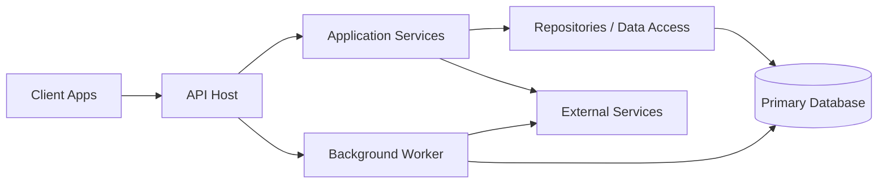

# Common Core Design Document

This document is a reusable architecture and design baseline for backend service projects. Use it as a shared core template, then customize the project-specific values in each section.

## 1. Purpose

Define a common engineering standard for:
- Architecture decisions
- Runtime composition
- Integration patterns
- Security and operations controls
- Scalability and reliability expectations

This document is intentionally project-agnostic so it can be reused across multiple services.

## 2. Design Principles

- Separation of concerns: API, application logic, data access, and infrastructure should be isolated.
- Explicit dependencies: all dependencies must be registered and traceable through dependency injection.
- Configuration over hardcoding: environment-specific behavior must come from configuration sources.
- Secure-by-default: no secrets in source control, minimal attack surface, authenticated access.
- Observable systems: health checks, logs, and metrics are mandatory for production readiness.
- Idempotent processing: background and integration flows should safely handle retries and duplicate events.

## 3. Logical Architecture (Core Pattern)

## 4. Standard Layer Model

### 4.1 Presentation Layer
- HTTP endpoints/controllers
- Request validation
- Authentication/authorization guards
- API contract and OpenAPI documentation

### 4.2 Application Layer
- Business use cases
- Workflow orchestration
- Transaction boundaries
- Domain-level validation rules

### 4.3 Data Layer
- Repository abstraction
- ORM/SQL access
- Mapping between domain and persistence models
- Query optimization and index-aware access patterns

### 4.4 Infrastructure Layer
- External APIs (HTTP clients)
- Messaging, cache, file storage, and background jobs
- Monitoring, diagnostics, and platform integrations

## 5. Runtime Blueprint

### 5.1 Startup Sequence
1. Build application host.
2. Load configuration providers.
3. Register core services (DI).
4. Register data contexts and repositories.
5. Register external clients.
6. Register workers/scheduled jobs.
7. Configure middleware pipeline.
8. Start application and health probes.

### 5.2 Middleware Baseline
- Global exception handling
- Correlation ID propagation
- CORS policy by environment
- Authentication and authorization
- Request/response logging (PII-safe)
- OpenAPI/Swagger (enabled by policy)
- Health endpoints (liveness and readiness)

## 6. Dependency Injection Standard

- `Scoped`: unit-of-work and request-bound services.
- `Transient`: lightweight stateless services.
- `Singleton`: shared thread-safe infrastructure components.

Guideline:
- Avoid service locator patterns.
- Keep constructor dependencies small and cohesive.
- Define interfaces for replaceable components.

## 7. Configuration Strategy

Configuration precedence should be deterministic:
1. Base config file
2. Environment-specific config file
3. Environment variables
4. Secret manager / vault
5. Runtime overrides (if required)

Required configuration domains:
- Database connections
- Authentication parameters
- Feature flags
- External API endpoints/timeouts
- Logging and telemetry settings

## 8. Data and Integration Patterns

### 8.1 Data Access
- Prefer explicit queries for critical paths.
- Use migrations and schema versioning.
- Enforce optimistic concurrency where relevant.

### 8.2 Background Processing
- Use retry with backoff for transient faults.
- Ensure idempotent handlers.
- Persist processing state for recovery.
- Support graceful shutdown and resume.

### 8.3 External Service Calls
- Typed clients with fixed timeout policies.
- Retry and circuit breaker for unstable dependencies.
- Standardized error mapping and fallback behavior.

## 9. Security Baseline

- No plaintext credentials in repository files.
- Secret rotation support.
- Least-privilege access for database and APIs.
- Strict CORS in non-development environments.
- TLS termination and forwarded headers validation.
- Input validation and output encoding controls.
- Audit-grade logging for sensitive operations.

## 10. Observability and Operations

- Structured logs with correlation IDs.
- Metrics for latency, throughput, error rate, and saturation.
- Health checks:
    - Liveness: process is alive.
    - Readiness: dependencies are available.
- Alerting thresholds for error spikes and dependency failures.

## 11. Deployment Blueprint

- Multi-stage container build.
- Immutable runtime image.
- Non-root container user.
- Explicit exposed ports.
- Environment-based runtime configuration.
- Zero-downtime rollout strategy (where platform supports it).

## 12. Non-Functional Requirements (Template)

- Availability target: `<set target, e.g. 99.9%>`
- P95 latency target: `<set target>`
- Recovery objectives:
    - RTO: `<set target>`
    - RPO: `<set target>`
- Scalability model: `<horizontal | vertical | mixed>`
- Data retention and compliance: `<set policy>`

## 13. Risk Register (Template)

1. Secret leakage risk from misconfigured environments.
2. Duplicate processing in multi-instance workers.
3. Integration fragility without resiliency controls.
4. Performance degradation from unbounded queries.
5. Operational blind spots without telemetry coverage.

## 14. Reuse Checklist for New Projects

Before adopting this template in a new project, confirm:
1. Layer boundaries are explicitly defined.
2. DI lifetimes are reviewed.
3. Configuration and secret sources are compliant.
4. Security baseline is implemented.
5. Health checks and telemetry are in place.
6. Retry/idempotency strategy is documented.
7. Deployment model is validated in non-production.

## 15. Project-Specific Adaptation Section

For each project, fill this section only:
- Project name: `<name>`
- Service type: `<API | Worker | Hybrid>`
- Primary database(s): `<db names>`
- External dependencies: `<services>`
- Main business modules: `<modules>`
- Environment matrix: `<dev/uat/prod definitions>`
- Project-specific exceptions to the core standard: `<exceptions>`

---

Document Type: Common Core Template  
Version: 2.0  
Last Updated: 2026-04-22
